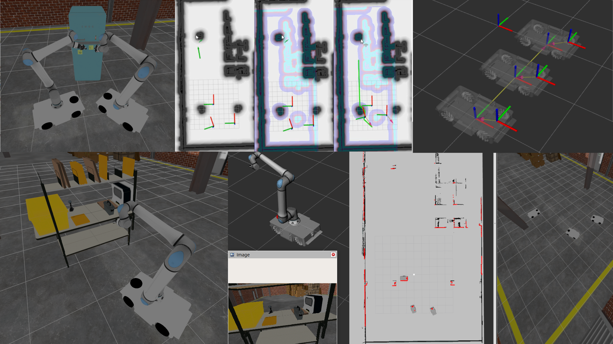

# RoboticsLab



This repository contains ROS 2 packages for a robotic system simulation using Gazebo(gz) and the Nav2 navigation stack.

## Prerequisites

- ROS 2 Kilted

## Building the Workspace

To compile the ROS workspace with colcon:

```bash
source /opt/ros/kilted/setup.bash 
cd ros_ws
colcon build --symlink-install
source install/setup.bash
```

The `--symlink-install` flag allows you to modify Python scripts and configuration files without rebuilding.

## Running the Simulation

### Launch Simulation and Visualization


Launch empty sandbox with GZ sim world, users might change the default world here by picking the chosen one on Fuel GZ:

```bash
ros2 launch lampo_description lampo_sandbox.launch.py
```

Populate the sandbox with a mobile robot with sensors, or a mobile manipulator with a gripper and a camera (mm:=true). Change the namespace with namespace:={name} when spawning multiple robots. 
This spawns also the GZ sim bridge for every robot, and the TF topic relays.

```bash
ros2 launch lampo_description lampo_gz_mm.launch.py 
ros2 launch lampo_description lampo_gz_mm.launch.py namespace:=r2 
ros2 launch lampo_description lampo_gz_mm.launch.py mm:=true 
ros2 launch lampo_description lampo_gz_mm.launch.py mm:=true namespace:=mm2 
```

Launch navigation stack, match the namespace of the robots spawned previously

```bash
ros2 launch lampo_description lampo_nav_omni.launch.py
ros2 launch lampo_description lampo_nav_omni.launch.py namespace:=r2 
ros2 launch lampo_description lampo_nav_omni.launch.py namespace:=mm2
```
## Windows Users - Devcontainer Setup with VcXsrv

Windows users can run this project using VSCode devcontainers with graphical support via VcXsrv.

### Prerequisites


1. Install [VSCode](https://code.visualstudio.com/) 
2. Install [Docker Desktop for Windows](https://www.docker.com/products/docker-desktop)
3. Install the [Dev Containers extension](https://marketplace.visualstudio.com/items?itemName=ms-vscode-remote.remote-containers) in VSCode, search it in the left bar extension tab
4. Install [VcXsrv](https://sourceforge.net/projects/vcxsrv/)

### Setup Instructions

1. **Configure VcXsrv:**
   - Launch XLaunch from the Start menu
   - Select "Multiple windows" and set display number to 0
   - Select "Start no client"
   - Save the configuration for future use

2. **Allow VcXsrv through Windows Firewall:**
   - Open Windows Defender Firewall
   - Click "Allow an app through firewall"
   - Find VcXsrv and enable both Private and Public networks

3. **Get your Windows host IP:**
   - Open PowerShell and run: `ipconfig`
   - Note your IPv4 address (typically 192.168.x.x or similar)

4. **Configure the devcontainer:**
   - Open the folder in VSCode
   - The `.devcontainer` configuration should already be set up
   - Ensure the `DISPLAY` environment variable is correctly set in `.devcontainer/devcontainer.json`

5. **Open in devcontainer:**
   - Press `F1` or `Ctrl+Shift+P` to open the command palette
   - Type and select: "Dev Containers: Reopen in Container"
   - Wait for the container to build and start

6. **Test the GUI:**
   - Once inside the container, ensure VcXsrv is running on Windows
   - Try launching the simulation as described above
   - The Gazebo and RViz windows should appear on your Windows desktop

### Troubleshooting

- **No display appearing:** Verify VcXsrv is running and "Disable access control" is checked
- **Connection refused:** Check Windows Firewall settings for VcXsrv
- **Display offset issues:** Ensure the DISPLAY variable in devcontainer matches your VcXsrv display number (typically :0)

